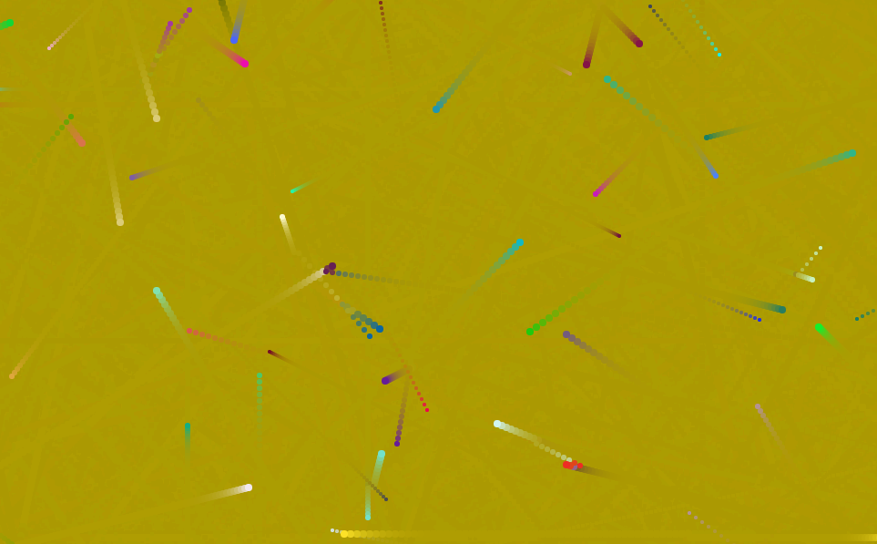

# Bouncing Balls: An object-Oriented programming activity (OOP)

This was an object building practice to show how useful objects can be in JavaScript.
Below is a link to the exercise:
https://developer.mozilla.org/en-US/docs/Learn/JavaScript/Objects/Object_building_practice
This assignment was completed as a guided group activity for about four hours.

## What I Learned

This was fun to dissect the code, line by line, and determine what impact it was designed to accomplish. Once we created the first ball, it was exciting to progress from that one object to many. It was fun to change the number of objects, size, color, velocity, create trails, etc.

## Screenshot
Here's a screen shot of the project.

